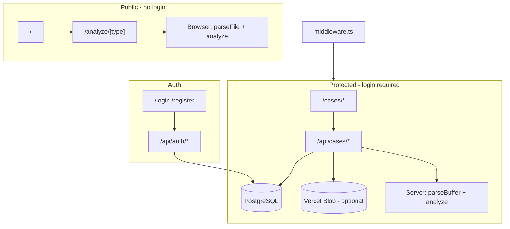

# Overview

## Purpose

**Cheshbon Analyzer** helps Israeli accountants quickly analyze financial documents:

- **תלוש שכר** (pay slip)
- **טופס 106** (annual tax form)
- **מקדמות** (advance tax)
- **ביטוח לאומי** (national insurance)
- **Generic** Excel/CSV/PDF analysis

The app also provides **client case management (תיקים)**: authenticated users create cases per client/tax year, upload documents, and view aggregated analysis on the server.

## Users & languages

- Primary audience: Israeli CPAs / accountants
- UI: **Hebrew (RTL, default)** and **English (LTR)**
- Locale stored in `localStorage` (`cheshbon-locale`)
- Theme: light/dark via `localStorage` (`cheshbon-theme`)

## Tech stack

| Layer | Technology |
|-------|------------|
| Framework | Next.js 16 (App Router) |
| UI | React 19, Tailwind CSS 4 |
| Language | TypeScript 5 |
| Database | PostgreSQL via Prisma Postgres (`db.prisma.io`) |
| ORM | Prisma 7 + `@prisma/adapter-pg` |
| Auth | Auth.js / NextAuth v5 beta |
| Excel | `xlsx` |
| PDF | `pdfjs-dist` (worker at `public/pdf.worker.mjs`) |
| Blob storage | `@vercel/blob` (optional) |
| Unit tests | Vitest |
| E2E | Playwright |
| Hosting | Vercel (region `fra1`) |

## High-level architecture

## Branding

- App name: **Cheshbon Analyzer** (חשבון = account/bookkeeping in Hebrew)
- Logo: blue square `#1a4d8c` + white calculator icon (Lucide)
- Favicon: `src/app/icon.tsx`, `src/app/apple-icon.tsx`

## Related docs

- [`architecture.md`](./architecture.md) — directory structure
- [`analyzers.md`](./analyzers.md) — analysis engine
- [`cases-and-documents.md`](./cases-and-documents.md) — case management
